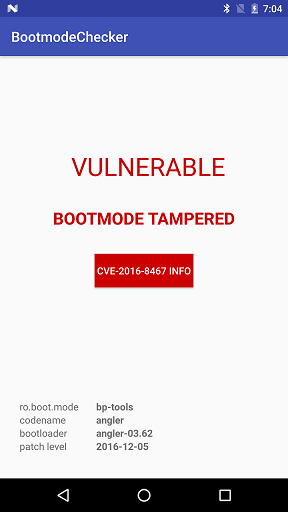

# bootmodechecker
This app checks if your Nexus 6/6P is still vulnerable to [CVE-2016-8467](https://securityresear.ch/2017/01/05/attacking-android-custom-bootmodes/) and/or if your bootmode property has been tampered with.

Also available under Google Play: https://play.google.com/store/apps/details?id=roeeh.bootmodechecker

